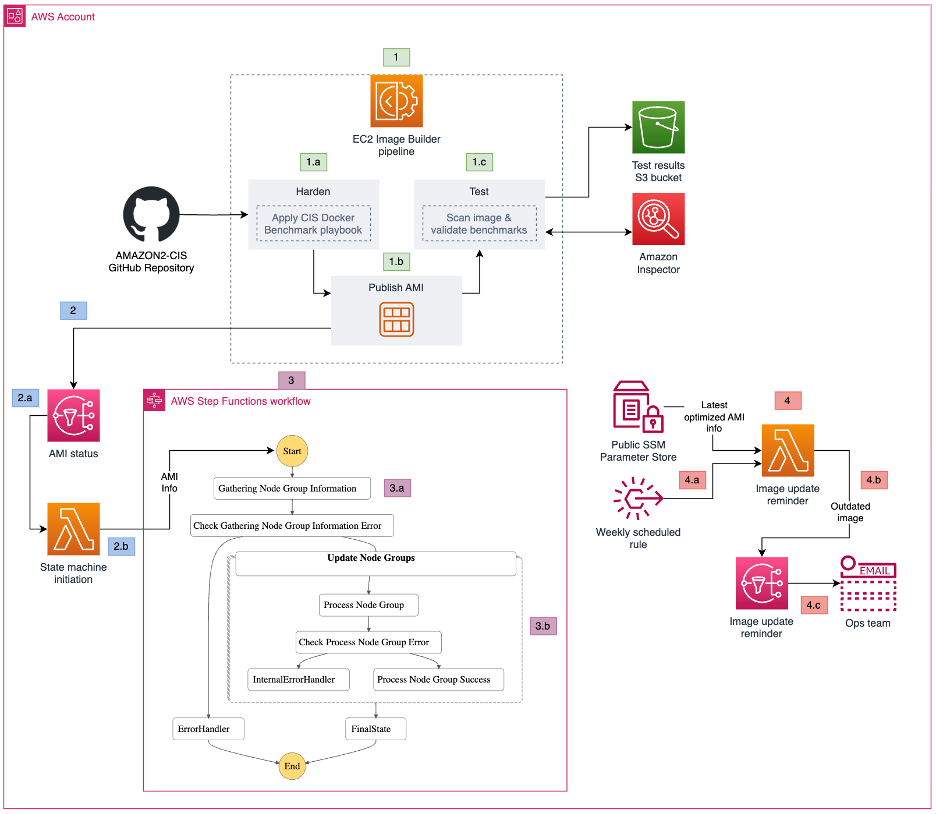

# EKS-Optimized AMI Hardening Pipeline

## Description

This repository contains a CloudFormation template that automates the creation of an EC2 Image Builder pipeline. The pipeline applies CIS Amazon Linux 2 or CIS Amazon Linux 2023 benchmarks (depoending on the base image) to an Amazon EKS-Optimized AMI using an Ansible playbook. The resulting hardened AMI is intended for use in updating Amazon EKS cluster node groups, enhancing security and compliance.

## Features

- Automated hardening of Amazon EKS-Optimized AMI against CIS Amazon Linux 2 benchmarks.
- Customizable Ansible playbook arguments for tailored AMI hardening.
- Integration with Amazon Inspector for enhanced AMI scanning.
- Automated updates to EKS cluster node groups with hardened AMIs.

## Prerequisites

- An AWS account with permissions to create the necessary resources.
- An existing EKS cluster with one or more managed node groups deployed with your own launch template
- AWS CLI installed
- Amazon Inspector for EC2 enabled in your AWS account

## Quick Start

1. Clone this repository to your local machine.
2. Navigate to the AWS CloudFormation console.
3. Choose "Create stack" and upload the provided [CloudFormation template](CloudFormation/AMI-Pipeline-Auto-Replace.yml).
4. Fill in the parameters as per your requirements. See the Parameters section below for details.
5. Follow the on-screen instructions to create the stack.

### Parameters

| Variable | Description |
|----------|----------|
| `AnsiblePlaybookArguments` | Custom arguments for the `ansible-playbook` command. |
| `LatestEKSOptimizedAMI` | The AWS Systems Manager Parameter Store parameter for the AMI ID. |
| `InstanceType` | EC2 instance type for Image Builder Infrastructure. |
| `ComponentName` | EC2 Image builder component name |
| `RecipeName` | EC2 Image builder recipe name |
| `InfrastructureConfigurationName` | EC2 Image builder infrastructure configuration name |
| `DistributionConfigurationName` | EC2 Image builder distribution configuration name |
| `ImagePipelineName` | EC2 Image builder pipeline name |
| `EnableImageScanning` | Toggle for Amazon Inspector AMI scanning. |
| `ClusterTags` | JSON string of key-value pairs to filter EKS clusters. Example: `[{"Key": "Team", "Value": "Development"}]` |
| `CloudFormationUpdaterEventBridgeRuleState` | State of the EventBridge rule for weekend checks on new base images. |

> [!IMPORTANT]
> Applying all CIS benchmarks to your base image cases EC2 Image Builder pipeline to fail, and prevents your nodes from joining the cluster. At a minimum, you need to pass below values as your template's `AnsiblePlaybookArguments` parameter value.
>
> Amazon Linux 2: `--extra-vars '{"amazon2cis_firewall":"external","amazon2cis_rule_4_5_2_4":false}' --skip-tags rule_6.2.11,rule_6.2.12,rule_6.2.13,rule_6.2.14,rule_6.2.15,rule_6.2.16,rule_6.2.17,rule_4.5.2.4`
>
> Amazon Linux 2023: `--extra-vars '{"amzn2023cis_syslog_service":"external","amzn2023cis_selinux_disable":true}' --skip-tags rule_1.1.2.3,rule_1.1.4.3,rule_1.2.1,rule_1.3.1,rule_1.3.3,firewalld,accounts,logrotate,rule_6.2.10`
>
> View [AMAZON2-CIS](https://github.com/ansible-lockdown/AMAZON2-CIS/blob/main/defaults/main.yml) and [AMAZON2023-CIS](https://github.com/ansible-lockdown/AMAZON2023-CIS/blob/main/defaults/main.yml) for a list of available variables for AL2 and AL2023 base images respectively.

## Architecture

This diagram illustrates the workflow of the EC2 Image Builder pipeline, from fetching the latest EKS-Optimized AMI to applying CIS benchmarks and distributing the hardened AMI.

## Contributing

We welcome contributions and suggestions! Please fork the repository and submit pull requests with your improvements. Check out the [CONTRIBUTING.md](CONTRIBUTING.md) file for guidelines on contributing.

## License

This project is licensed under the [MIT License](LICENSE).
